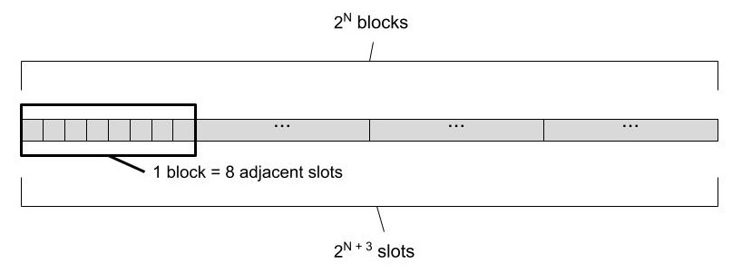
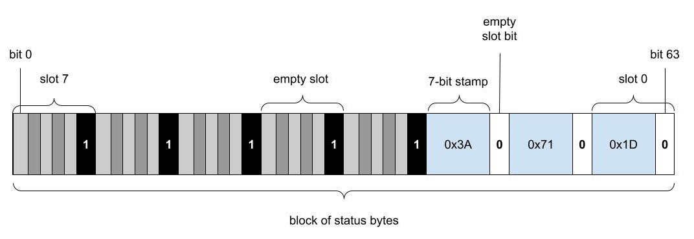
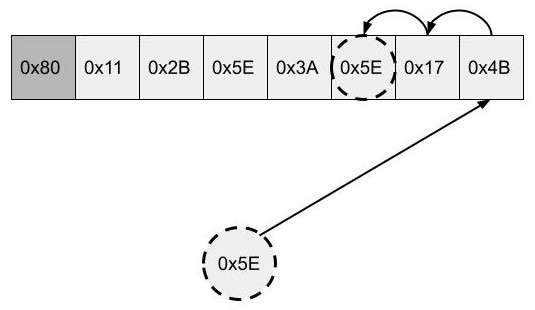
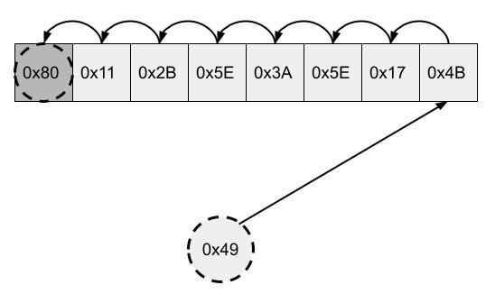
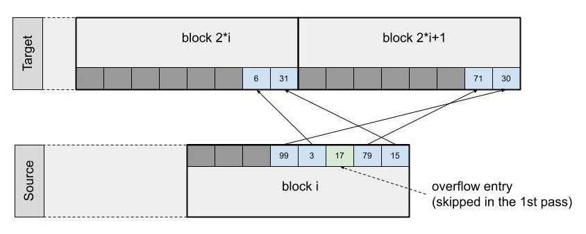

# Swiss Table

A specialized hash table implementation used to dynamically map combinations of key field values to a dense set of integer ids. Ids can later be used in place of keys to identify groups of rows with equal keys.

## Introduction

Hash group-by in Arrow uses a variant of a hash table based on a data structure called Swiss table. Swiss table uses linear probing. There is an array of slots and the information related to inserted keys is stored in these slots. A hash function determines the slot where the search for a matching key will start during hash table lookup. Then the slots are visited sequentially, wrapping around the end of an array, until either a match or an empty slot is found, the latter case meaning that there is no match.  Swiss table organizes the slots in blocks of 8 and has a design that enables data level parallelism at the block level. More precisely, it allows for visiting all slots within a block at once during lookups, by simply using 64-bit arithmetic. SIMD instructions can further enhance this data level parallelism allowing to process multiple blocks related to multiple input keys together using SIMD vectors of 64-bit elements. Occupied slots within a block are always clustered together. The name Swiss table comes from likening resulting sequences of empty slots to holes in a one dimensional cheese.

## Interface

Hash table used in query processing for implementing join and group-by operators does not need to provide all of the operations that a general purpose hash table would. Simplified requirements can help achieve a simpler and more efficient design. For instance we do not need to be able to remove previously inserted keys. It’s an append-only data structure: new keys can be added but old keys are never erased. Also, only a single copy of each key can be inserted - it is like `std::map` in that sense and not `std::multimap`.

Our Swiss table is fully vectorized. That means that all methods work on vectors of input keys processing them in batches. Specialized SIMD implementations of processing functions are almost always provided for performance critical operations. All callback interfaces used from the core hash table code are also designed to work on batches of inputs instead of individual keys. The batch size can be almost arbitrary and is selected by the client of the hash table. Batch size should be the smallest number of input items, big enough so that the benefits of vectorization and SIMD can be fully experienced. Keeping it small means less memory used for temporary arrays storing intermediate results of computation (vector equivalent of some temporary variables kept on the stack). That in turn means smaller space in CPU caches, which also means less impact on other memory access intensive operations. We pick 1024 as the default size of the batch. We will call it a **mini-batch** to distinguish it from potentially other forms of batches used at higher levels in the code, e.g. when scheduling work for worker threads or relational operators inside an analytic query.

The main functionality provided by Swiss table is mapping of arbitrarily complex keys to unique integer ids. Let us call it **lookup-or-insert**. Given a sequence of key values, return a corresponding sequence of integer ids, such that all keys that are equal receive the same id and for K distinct keys the integer ids will be assigned from the set of numbers 0 to (K-1). If we find a matching key in a hash table for a given input, we return the **key id** assigned when the key was first inserted into a hash table. If we fail to find an already inserted match, we assign the first unused integer as a key id and add a new entry to a hash table. Due to vectorized processing, which may result in out-of-order processing of individual inputs, it is not guaranteed that if there are two new key values in the same input batch and one of them appears earlier in the input sequence, then it will receive a smaller key id. Additional mapping functionality can be built on top of basic mapping to integer key id, for instance if we want to assign and perhaps keep updating some values to all unique keys, we can keep these values in a resizable vector indexed by obtained key id.

The implementation of Swiss table does not need to have any information related to the domain of the keys. It does not use their logical data type or information about their physical representation and does not even use pointers to keys. All access to keys is delegated to a separate class or classes that provide callback functions for three operations:
-   computing hashes of keys;
-   checking equality for given pairs of keys;
-   appending a given sequence of keys to a stack maintained outside of Swiss table object, so that they can be referenced later on by key ids (key ids will be equal to their positions in the stack).
    

When passing arguments to callback functions the keys are referenced using integer ids. For the left side - that is the keys present in the input mini-batch - ordinal positions within that mini-batch are used. For the right side - that is the keys inserted into the hash table - these are identified by key ids assigned to them and stored inside Swiss table when they were first encountered and processed.

Diagram with logical view of information passing in callbacks:

