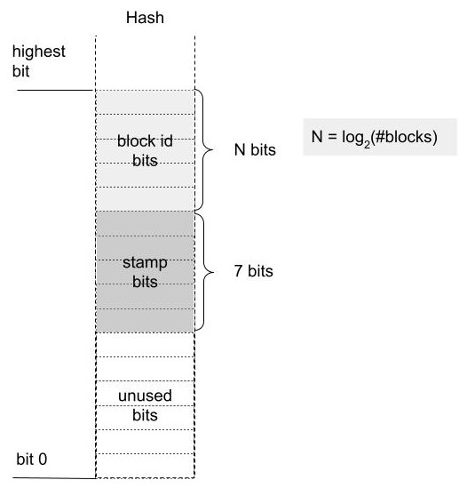
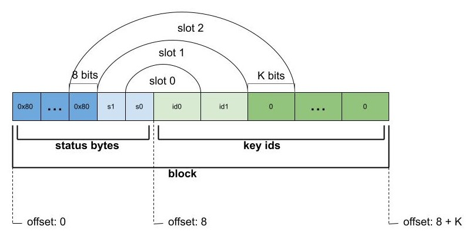

# Swiss Table

A specialized hash table implementation used to dynamically map combinations of key field values to a dense set of integer ids. Ids can later be used in place of keys to identify groups of rows with equal keys.

## Introduction

Hash group-by in Arrow uses a variant of a hash table based on a data structure called Swiss table. Swiss table uses linear probing. There is an array of slots and the information related to inserted keys is stored in these slots. A hash function determines the slot where the search for a matching key will start during hash table lookup. Then the slots are visited sequentially, wrapping around the end of an array, until either a match or an empty slot is found, the latter case meaning that there is no match.  Swiss table organizes the slots in blocks of 8 and has a design that enables data level parallelism at the block level. More precisely, it allows for visiting all slots within a block at once during lookups, by simply using 64-bit arithmetic. SIMD instructions can further enhance this data level parallelism allowing to process multiple blocks related to multiple input keys together using SIMD vectors of 64-bit elements. Occupied slots within a block are always clustered together. The name Swiss table comes from likening resulting sequences of empty slots to holes in a one dimensional cheese.

## Interface

Hash table used in query processing for implementing join and group-by operators does not need to provide all of the operations that a general purpose hash table would. Simplified requirements can help achieve a simpler and more efficient design. For instance we do not need to be able to remove previously inserted keys. It’s an append-only data structure: new keys can be added but old keys are never erased. Also, only a single copy of each key can be inserted - it is like `std::map` in that sense and not `std::multimap`.

Our Swiss table is fully vectorized. That means that all methods work on vectors of input keys processing them in batches. Specialized SIMD implementations of processing functions are almost always provided for performance critical operations. All callback interfaces used from the core hash table code are also designed to work on batches of inputs instead of individual keys. The batch size can be almost arbitrary and is selected by the client of the hash table. Batch size should be the smallest number of input items, big enough so that the benefits of vectorization and SIMD can be fully experienced. Keeping it small means less memory used for temporary arrays storing intermediate results of computation (vector equivalent of some temporary variables kept on the stack). That in turn means smaller space in CPU caches, which also means less impact on other memory access intensive operations. We pick 1024 as the default size of the batch. We will call it a **mini-batch** to distinguish it from potentially other forms of batches used at higher levels in the code, e.g. when scheduling work for worker threads or relational operators inside an analytic query.

The main functionality provided by Swiss table is mapping of arbitrarily complex keys to unique integer ids. Let us call it **lookup-or-insert**. Given a sequence of key values, return a corresponding sequence of integer ids, such that all keys that are equal receive the same id and for K distinct keys the integer ids will be assigned from the set of numbers 0 to (K-1). If we find a matching key in a hash table for a given input, we return the **key id** assigned when the key was first inserted into a hash table. If we fail to find an already inserted match, we assign the first unused integer as a key id and add a new entry to a hash table. Due to vectorized processing, which may result in out-of-order processing of individual inputs, it is not guaranteed that if there are two new key values in the same input batch and one of them appears earlier in the input sequence, then it will receive a smaller key id. Additional mapping functionality can be built on top of basic mapping to integer key id, for instance if we want to assign and perhaps keep updating some values to all unique keys, we can keep these values in a resizable vector indexed by obtained key id.

The implementation of Swiss table does not need to have any information related to the domain of the keys. It does not use their logical data type or information about their physical representation and does not even use pointers to keys. All access to keys is delegated to a separate class or classes that provide callback functions for three operations:
-   computing hashes of keys;
-   checking equality for given pairs of keys;
-   appending a given sequence of keys to a stack maintained outside of Swiss table object, so that they can be referenced later on by key ids (key ids will be equal to their positions in the stack).
    

When passing arguments to callback functions the keys are referenced using integer ids. For the left side - that is the keys present in the input mini-batch - ordinal positions within that mini-batch are used. For the right side - that is the keys inserted into the hash table - these are identified by key ids assigned to them and stored inside Swiss table when they were first encountered and processed.

Diagram with logical view of information passing in callbacks:

Hash table values for inserted keys are also stored inside Swiss table. Because of that, hash table logic does not need to ever re-evaluate the hash, and there is actually no need for a hash function callback. It is enough that the caller provides hash values for all entries in the batch when calling lookup-or-insert.

## Basic architecture and organization of data
The hash table is an array of **slots**. Slots are grouped in groups of 8 called **blocks**. The number of blocks is a power of 2. The empty hash table starts with a single block, with all slots empty. Then, as the keys are getting inserted and the amount of empty slots is shrinking, at some point resizing of the hash table is triggered. The data stored in slots is moved to a new hash table that has the double of the number of blocks.

The diagram below shows the basic organization of data in our implementation of Swiss table:

N is the log of the number of blocks, 2n+3 is  the number of slots and also the maximum number of inserted keys and hence (N + 3) is the number of bits required to store a key id. We will refer to N as the **size of the hash table**.

Index of a block within an array will be called **block id**, and similarly index of a slot will be **slot id**. Sometimes we will focus on a single block and refer to slots that belong to it by using a **local slot id**, which is an index from 0 to 7.

Every slot can either be **empty** or store data related to a single inserted key. There are three pieces of information stored inside a slot:
- status byte,
- key id,
- key hash.

Status byte, as the name suggests, stores 8 bits. The highest bit indicates if the slot is empty (the highest bit is set) or corresponds to one of inserted keys (the highest bit is zero). The remaining 7 bits contain 7 bits of key hash that we call a **stamp**. The stamp is used to eliminate some false positives when searching for a matching key for a given input. Slot also stores **key id**, which is a non-negative integer smaller than the number of inserted keys, that is used as a reference to the actual inserted key. The last piece of information related to an inserted key is its **hash** value. We store hashes for all keys, so that they never need to be re-computed. That greatly simplifies some operations, like resizing of a hash table, that may not even need to look at the keys at all. For an empty slot, the status byte is 0x80, key id is zero and the hash is not used and can be set to any number.

A single block contains 8 slots and can be viewed as a micro-stack of up to 8 inserted keys. When the first key is inserted into an empty block, it will occupy a slot with local id 0. The second inserted key will go into slot number 1 and so on. We use N highest bits of hash to get an index of a **start block**, when searching for a match or an empty slot to insert a previously not seen key when that is the case. If the start block contains any empty slots, then the search for either a match or place to insert a key will end at that block. We will call such a block an **open block**. A block that is not open is a full block. In the case of full block, the input key related search may continue in the next block module the number of blocks. If the key is not inserted into its start block, we will refer to it as an **overflow** entry, other entries being **non-overflow**. Overflow entries are slower to process, since they require visiting more than one block, so we want to keep their percentage low. This is done by choosing the right **load factor** (percentage of occupied slots in the hash table) at which the hash table gets resized and the number of blocks gets doubled. By tuning this value we can control the probability of encountering an overflow entry.

The most interesting part of each block is the set of status bytes of its slots, which is simply a single 64-bit word. The implementation of efficient searches across these bytes during lookups require using either leading zero count or trailing zero count intrinsic. Since there are cases when only the first one is available, in order to take advantage of it, we order the bytes in the 64-bit status word so that the first slot within a block uses the highest byte and the last one uses the lowest byte (slots are in reversed bytes order). The diagram below shows how the information about slots is stored within a 64-bit status word:

Each status byte has a 7-bit fragment of hash value - a **stamp** - and an empty slot bit. Empty slots have status byte equal to 0x80 - the highest bit is set to 1 to indicate an empty slot and the lowest bits, which are used by a stamp, are set to zero.

The diagram below shows which bits of hash value are used by hash table:

If a hash table has 2N blocks, then we use N highest bits of a hash to select a start block when searching for a match. The next 7 bits are used as a stamp. Using the highest bits to pick a start block means that a range of hash values can be easily mapped to a range of block ids of start blocks for hashes in that range. This is useful when resizing a hash table or merging two hash tables together.

### Interleaving status bytes and key ids

Status bytes and key ids for all slots are stored in a single array of bytes. They are first grouped by 8 into blocks, then each block of status bytes is interleaved with a corresponding block of key ids. Finally key ids are represented using the smallest possible number of bits and bit-packed (bits representing each next key id start right after the last bit of the previous key id). Note that regardless of the chosen number of bits, a block of bit-packed key ids (that is 8 of them) will start and end on the byte boundary.

The diagram below shows the organization of bytes and bits of a single block in interleaved array:

From the size of the hash table we can derive the number K of bits needed in the worst case to encode any key id. K is equal to the number of bits needed to represent slot id (number of keys is not greater than the number of slots and any key id is strictly less than the number of keys), which for a hash table of size N (N blocks) equals (N+3). To simplify bit packing and unpacking and avoid handling of special cases, we will round up K to full bytes for K > 24 bits.

Status bytes are stored in a single 64-bit word in reverse byte order (the last byte corresponds to the slot with local id 0). On the other hand key ids are stored in the normal order (the order of slot ids).

Since both status byte and key id for a given slot are stored in the same array close to each other, we can expect that most of the lookups will read only one CPU cache-line from memory inside Swiss table code (then at least another one outside Swiss table to access the bytes of the key for the purpose of comparison). Even if we hit an overflow entry, it is still likely to reside on the same cache-line as the start block data. Hash values, which are stored separately from status byte and key id, are only used when resizing and do not impact the lookups outside these events.

> Improvement to consider:
> In addition to the Swiss table data, we need to store an array of inserted keys, one for each key id. If keys are of fixed length, then the address of the bytes of the key can be calculated by multiplying key id by the common length of the key. If keys are of varying length, then there will be an additional array with an offset of each key within the array of concatenated bytes of keys. That means that any key comparison during lookup will involve 3 arrays: one to get key id, one to get key offset and final one with bytes of the key. This could be reduced to 2 array lookups if we stored key offset instead of key id interleaved with slot status bytes. Offset indexed by key id and stored in its own array becomes offset indexed by slot id and stored interleaved with slot status bytes. At the same time key id indexed by slot id and interleaved with slot status bytes before becomes key id referenced using offset and stored with key bytes. There may be a slight increase in the total size of memory needed by the hash table, equal to the difference in the number of bits used to store offset and those used to store key id, multiplied by the number of slots, but that should be a small fraction of the total size.

### 32-bit hash vs 64-bit hash

Currently we use 32-bit hash values in Swiss table code and 32-bit integers as key ids. For the robust implementation, sooner or later we will need to support 64-bit hash and 64-bit key ids. When we use 32-bit hash, it means that we run out of hash bits when hash table size N is greater than 25 (25 bits of hash needed to select a block and 7 bits needed to generate a stamp byte reach 32 total bits). When the number of inserted keys exceeds the maximal number of keys stored in a hash table of size 25 (which is at least 224), the chance of false positives during lookups will start quickly growing. 32-bit hash should not be used with more than about 16 million inserted keys.

### Low memory footprint and low chance of hash collisions

Swiss table is a good choice of a hash table for modern hardware, because it combines lookups that can take advantage of special CPU instructions with space efficiency and low chance of hash collisions.

Space efficiency is important for performance, because the cost of random array accesses, often dominating the lookup cost for larger hash tables, increases with the size of the arrays. This happens due to limited space of CPU caches. Let us look at what is the amortized additional storage cost for a key in a hash table apart from the essential cost of storing data of all those keys. Furthermore, we can skip the storage of hash values, since these are only used during infrequent hash table resize operations (should not have a big impact on CPU cache usage in normal cases).

Half full hash table of size N will use 2 status bytes per inserted key (because for every filled slot there is one empty slot) and 2*(N+3) bits for key id (again, one for the occupied slot and one for the empty). For N = 16 for instance this is slightly under 7 bytes per inserted key.

